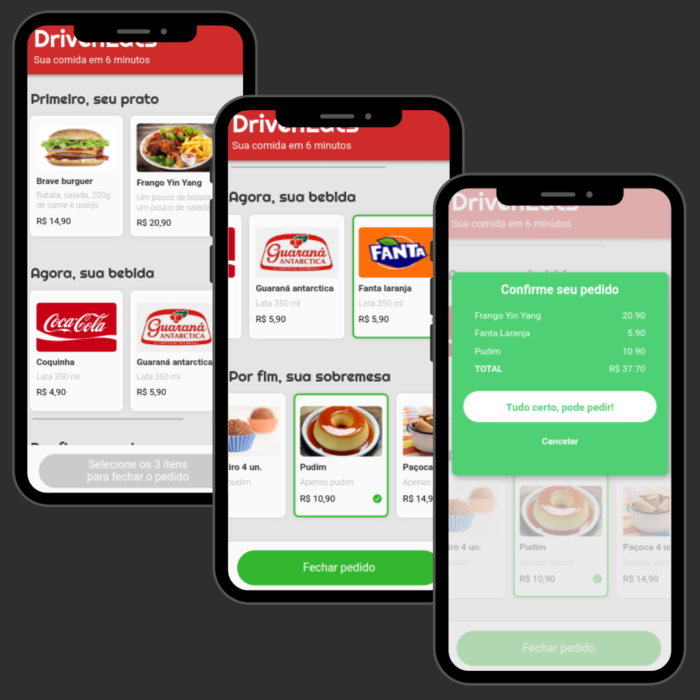

  <h1><strong>DRIVEN EATS</strong></h1>

 
  
- Criação de um aplicativo web para fast food
   
- Exclusivo para mobile

# Tópicos explorados

- Funções JavaScript
- Onclick
- DOM

# Tecnologias 
- 
- 
- 
- 
- 
- 

# Preview

  
   
   
  
Clique na imagem para acessar a página

 
